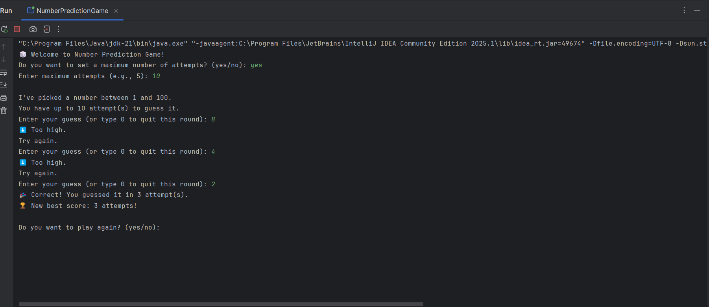

# Number Prediction Game 🎲✨

A simple Java console game where the program generates a random number between 1 and 100, and you try to guess it!  
This project was created as part of my MotionCut Internship (Week 3 Project).

---

## 🚀 Features
- Random number between **1 and 100**
- Feedback on each guess (**Too high / Too low / Correct**)
- Option to limit the maximum number of attempts
- Tracks and displays your **best score** (fewest attempts)
- Allows quitting a round by typing `0`
- Simple, beginner-friendly, and interactive

---

## 🖥️ Example Run
```
🎲 Welcome to Number Prediction Game!
Do you want to set a maximum number of attempts? (yes/no): yes
Enter maximum attempts (e.g., 5): 5

I've picked a number between 1 and 100.
You have up to 5 attempt(s) to guess it.
Enter your guess (or type 0 to quit this round): 50
⬆️ Too low.
Try again.
Enter your guess (or type 0 to quit this round): 75
⬇️ Too high.
Try again.
Enter your guess (or type 0 to quit this round): 62
🎉 Correct! You guessed it in 3 attempt(s).
🏆 New best score: 3 attempts!

Do you want to play again? (yes/no): no
Thanks for playing! Goodbye 👋
```

---

## 📸 Screenshot
Here’s a screenshot of the console output demo:  

  
 


---

## ⚙️ How to Run
1. Clone this repository:
   ```bash
   git clone https://github.com/your-username/NumberPredictionGame.git
   ```
2. Open the project in **IntelliJ IDEA** (or any Java IDE).
3. Navigate to the `src/` folder.
4. Compile and run:
   ```bash
   javac NumberPredictionGame.java
   java NumberPredictionGame
   ```

---

## 📚 Concepts Used
- Java **Random** class to generate secret number
- Java **Scanner** for user input
- **if-else** conditions for feedback
- Loop (`while`) for repeated guesses
- Input validation and error handling

---

## ✨ Author
👤 **Sandip Pal**
- GitHub: [sandip-pal1](https://github.com/sandip-pal1)
- LinkedIn: [Sandip Pal](https://www.linkedin.com/in/sandip-pal-7877b9285/)
